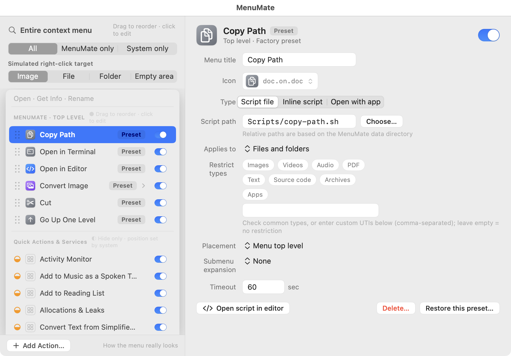
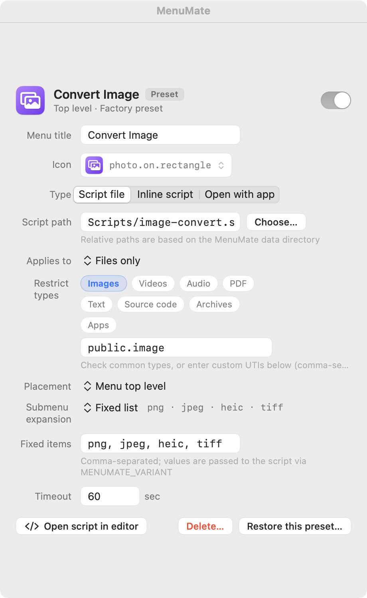
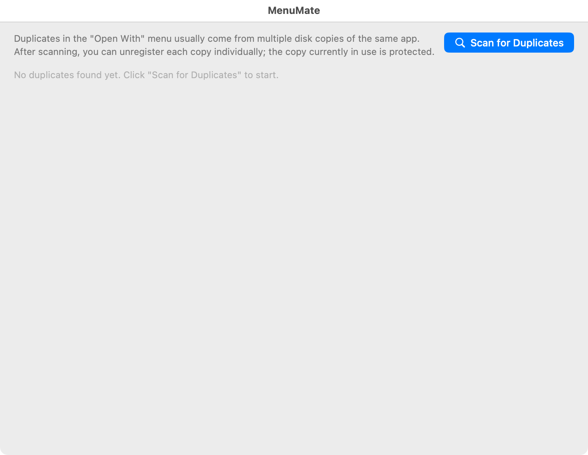

# MenuMate

**Take full control of Finder's right-click menu on macOS.**

English · [简体中文](README.zh.md)

MenuMate is a script-first, open-source (MIT) menu-bar app that lets you add your own
right-click actions, manage the system menu items other tools can't touch, and install
community “extension packs” — all without repeating permission prompts. Distributed as a
Developer ID app (non-sandboxed main app + sandboxed Finder Sync extension); requires
macOS 13 Ventura+. UI in **English / 简体中文**.

<p align="center">
  
</p>

---

## Why MenuMate

Most right-click tools on the Mac (右键超人 / MouseBoost / Service Station …) ship through the
sandboxed App Store, so they **can only manage menu items they inject themselves**. MenuMate
ships outside the sandbox (Developer ID), which unlocks things the sandbox makes structurally
impossible:

| Capability | Sandboxed tools | MenuMate |
|------------|-----------------|----------|
| Inject custom script actions | partial | ✓ script-first, fully configurable |
| Toggle system Quick Actions / Services | ✗ | ✓ via the `pbs` domain |
| Enable/disable third-party Finder extensions | ✗ | ✓ via `pluginkit` |
| Clean up duplicate “Open With” entries | ✗ | ✓ via `lsregister -u` |
| Install community packs (any git repo) | ✗ | ✓ see the [pack spec](docs/pack-spec.md) |

**The core idea is script-first.** Even the built-ins are editable zsh scripts — a preset *is*
a factory script you can edit, delete, or restore at any time.

---

## Features

### Script-first custom actions, fully configurable

Every action is a zsh script (or an inline snippet, or “open with an app”). Give it a custom
icon (SF Symbol + tint, or import your own image), and scope it to file types by ticking
friendly categories (Images / Videos / Audio / PDF / Text / Source code / Archives / Apps) or
entering raw UTIs.

<p align="center"></p>

### Manage the *whole* right-click menu, not just your own items

One screen shows your menu exactly as it appears, with a “simulate target” switch
(image / file / folder / empty area) so you see what really shows up. Items are grouped by how
much MenuMate can control them: **●** your own & pack actions (reorder, edit, toggle, delete),
**◐** system Quick Actions & Services (hide), **○** third-party extensions (toggle).

### Clean up “Open With” duplicates

Spotlight-scan for apps registered from multiple disk locations and precisely unregister the
stale copies with `lsregister -u` — without the `-kill` sledgehammer that breaks System
Settings.

<p align="center"></p>

### Switch terminal / editor without editing scripts

Pick your default terminal and editor in **General**; the “Open in Terminal / Editor” presets
honor your choice via injected env vars — no script changes needed.

### Community extension packs

Any conforming git repo is an extension pack. Import by URL; MenuMate clones it **read-only**,
makes you review every script, and adds the actions **disabled** until you enable them. See the
[Extension Pack Specification](docs/pack-spec.md) and the [example pack](examples/example-pack/).

### Bilingual & no repeating prompts

Full **English / 简体中文** UI (String Catalogs — adding a language is just a translation
column). And because the extension reads no files and there's no App Group container, MenuMate
avoids the macOS 14/15 “wants to access data from other apps” nag; the few permissions it does
need are requested **once** in onboarding.

---

## Built-in presets (9 editable scripts)

All use only built-in macOS CLIs, zero external dependencies. View/edit them under
**Settings › Context Menu**; restore factory defaults under **Settings › General**.

| Script | Action | What it does |
|--------|--------|--------------|
| `copy-path.sh` | Copy Path | `pbcopy`, one path per line for multi-select |
| `new-file.sh` | New File | submenu of your template folder; `cp` + auto-numbered renames |
| `open-terminal.sh` | Open in Terminal | terminal chosen in General (`MENUMATE_TERMINAL`) |
| `open-editor.sh` | Open in Editor | editor chosen in General (`MENUMATE_EDITOR`) |
| `image-convert.sh` | Convert Image | submenu png/jpeg/heic/tiff via `sips`; images only |
| `cut.sh` / `paste.sh` | Cut / Paste Here | move via a data-dir cutbuffer |
| `open-parent.sh` / `open-enclosing.sh` | Go Up One Level | navigate up in the current Finder window — or in a browser's upload dialog via `⌘↑` |

---

## Install / build from source

Requirements: macOS 13+, Xcode 15+ (String Catalogs), Homebrew (for `xcodegen`).

```bash
make bootstrap   # install xcodegen + copy the local signing config
make gen         # project.yml → MenuMate.xcodeproj (git-ignored)
make test        # run MenuMateCore unit tests
make build       # Debug build
make run         # build + launch
```

Then enable the Finder extension (onboarding links you to System Settings, or
`pluginkit -e use -i com.menumate.app.FinderExtension`) and grant the one-time permissions.

A signed/notarized release build is produced by `make release` / the GitHub release workflow —
see [docs/RELEASING.md](docs/RELEASING.md).

## Script environment contract

Every script (preset or pack) is run under `/bin/zsh` with:

| variable / arg | meaning |
|----------------|---------|
| `$1 … $n` | absolute paths of selected items (the container path for empty-area actions) |
| `MENUMATE_PATHS` | all paths, newline-separated |
| `MENUMATE_VARIANT` | the chosen submenu value (e.g. `jpeg`) |
| `MENUMATE_TEMPLATES` / `MENUMATE_DATA` | template & data directories |
| `MENUMATE_TERMINAL` / `MENUMATE_EDITOR` | your chosen default terminal / editor bundle id |
| exit `0` | success; first stdout line is the summary |
| exit non-`0` | failure; stderr surfaced in “Recent Executions” + a notification |

## Architecture

| Target | What | Sandbox | Responsibility |
|--------|------|---------|----------------|
| MenuMate | SwiftUI menu-bar app (`LSUIElement`) | No | config, action execution, system-menu management, packs |
| FinderExtension | `FIFinderSync` extension | Yes | draw the menu, forward clicks |
| MenuMateCore | local Swift package | — | models, config codec, rule matching (unit-tested) |

The extension reads **no files**: the main app pushes a menu snapshot over
`DistributedNotificationCenter` (chunked). No App Group container — this is what eliminates the
repeating macOS permission prompts.

## Docs & contributing

- [Extension Pack Specification](docs/pack-spec.md) · [example pack](examples/example-pack/)
- [Contributing](CONTRIBUTING.md) · [Releasing](docs/RELEASING.md)
- Core unit tests (119) run in CI on every push (`.github/workflows/ci.yml`).

## Known limitations

- FinderSync dead zones: `/Applications`, iCloud / File Provider directories don't trigger the
  extension (system behavior).
- Injected items always appear at the bottom of the context menu (system limitation).
- Shortcuts-based Quick Actions can only be hidden (their state lives in a TCC-protected DB).
- Preset titles are localized at seed time; switching system language later won't re-translate
  already-stored titles (restore factory presets to re-seed).

## License

[MIT](LICENSE) © 2026 Hibrielle
