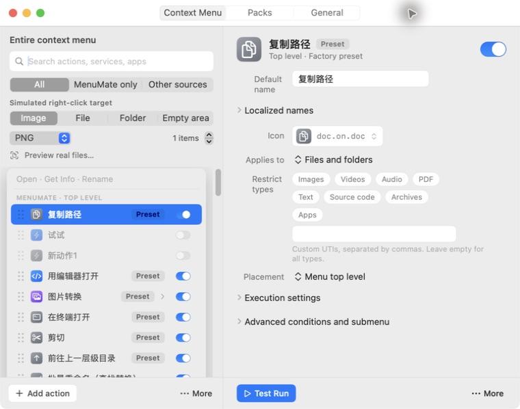
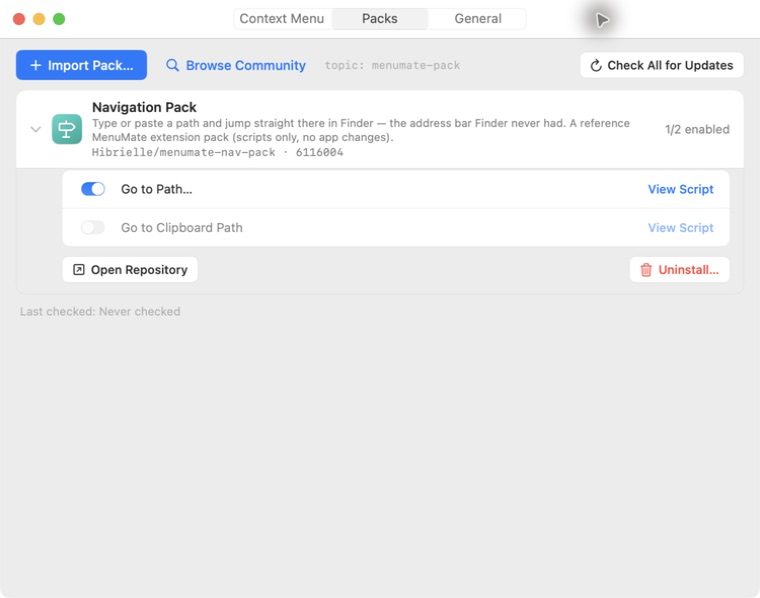

# MenuMate

**Customize Finder's context menu with editable scripts and optional HTML dialogs.**

English · [简体中文](README.zh.md)

MenuMate is an open-source macOS menu-bar app. Create file actions, organize when they
appear, and install community extension packs. The main app executes actions; a Finder
Sync extension supplies the context menu. macOS 13+ · English / Simplified Chinese · MIT.

This README describes the current source tree. Published releases may not include every
feature described here.

## Screenshots

Captured from the running macOS app. Action names reflect the local configuration.

**In Finder** — enabled actions appear in the actual context menu. Image conversion
expands into format choices (shown on a Chinese-language macOS installation).


**Context menu and action editor** — preview matching actions and edit their settings.



**Extension packs** — expand a pack to enable individual actions and inspect their scripts.



## What you can do

- **Organize actions visually.** Preview Image / File / Folder / Empty area contexts, choose
  a concrete sample type and selection count, or read metadata from real files. Search
  actions, services and apps. Configure titles, icons, matching rules and placement.
- **Keep simple actions direct.** Use a zsh file, inline script or Open with App. Actions
  needing options can open a local HTML page in a native WebView before submitting parameters.
- **Try generated samples.** Test runs create their own images, documents and folders under
  MenuMate's data directory. Inspect the generated inputs and results from Open folder.
- **Install packs.** One Git repository contains one pack with multiple independently
  enabled actions. Each action can have its own script and HTML page.
- **Inspect recent executions.** Search by action, selected path or output, filter success
  and failure, and expand a record to inspect its date, duration, exit code and output.

The interface follows the macOS language. Edit an action’s **Default name** and expand
**Localized names** to provide English and Simplified Chinese names. Missing translations
use the default name. Pack authors can also translate pack names and descriptions in the
manifest; HTML page translations remain the author’s responsibility.

## Menu management boundaries

| Item | Current support |
| --- | --- |
| MenuMate and pack actions | Enable/disable, matching, placement and ordering; pack execution code is managed through pack updates |
| Traditional application Services | Manage supported entries exposed through `pbs`; changes may also affect application Services menus |
| Third-party Finder Sync extensions | Toggle the whole supported extension through `pluginkit` |
| Built-in Quick Actions such as Rotate, Markup and Remove Background | Not comprehensively managed by the Services list |
| Preview | Uses the same matcher as MenuMate actions; other apps' menu visibility is decided by Finder |

Finder Sync availability varies by location, OS version and file provider. This app does
not control every item in every context menu.

## Build and try

Use macOS 13+, Xcode 16+ and Homebrew for `xcodegen`. The development build uses the signing
settings in `Local.xcconfig`; release signing and notarization are separate steps.

```sh
make bootstrap   # install xcodegen and create Local.xcconfig if needed
make test        # Core tests
make test-packs  # isolated tests against the actual pack manager
make test-history # isolated runner/history integration tests
make test-storage # config write failures and interrupted pack transactions
make build       # build app and Finder extension
make run         # build and launch
```

The built app is `build/Build/Products/Debug/MenuMate.app`. Open MenuMate from its menu-bar
icon, choose Settings, and follow onboarding to enable the Finder extension. Reopening the
app when it has no visible windows also opens Settings. Permission requirements depend on
which actions you run.

From Context Menu, choose an action to edit it. Execution settings and advanced conditions
are expandable; the bottom action bar stays visible while the form scrolls. General lets
you choose a terminal/editor and open the scripts/templates folders.

## Write an extension pack

Follow the [extension development guide](docs/extension-development.md) to build script actions,
add HTML forms, receive selected files, submit parameters, display results, and test/update/publish a pack.

The [copyable starter pack](examples/selection-info-pack/) includes a direct action and an HTML
action. Use the [pack specification](docs/pack-spec.md) for the complete field reference.

## Try the HTML example pack

```sh
zsh scripts/prepare-image-tools-pack.sh
```

Paste the printed local Git repository path into **Packs → Import**. Review the source and
confirm. The **Image Tools** pack contains JPEG compression and image format conversion,
each with its own HTML dialog. Imported actions start disabled and can be tested individually.
The example preserves originals and numbers colliding output names.

You can also import a conforming repository using `owner/repo`, a Git URL or a local Git
repository path. A subdirectory inside a repository is not independently importable.
Browse community packs discovers repositories tagged `menumate-pack`.

Updates show changes across the pack, including JS/CSS dependencies, the manifest, binary
summaries and symlinks. Updating preserves local titles/placement when they differ from the
old defaults, as well as ordering and enabled state. Re-importing an installed pack directs
you to Check for Updates. Updates and uninstall apply to the entire pack.

Import, update and uninstall use a recovery journal covering the pack directory, installation
registry and action configuration. Failed operations restore the previous state; after an
unexpected app exit, startup rolls back an uncommitted operation or finishes cleanup for a
committed one. A pack cannot be updated or uninstalled while its actions are queued/running
or its HTML dialogs are open. If recovery fails, backups remain and actions are paused until
recovery succeeds.

Settings changes reach Finder only after they are saved. Failed saves leave the last saved
configuration active and show an error; action editors offer Retry save. Corrupt configuration
and installation records are preserved instead of being silently replaced.

See the [pack specification](docs/pack-spec.md), [script example](examples/example-pack/)
and [HTML example pack](examples/image-tools-pack/).

## Recent executions

Open **Recent Executions** from the menu-bar icon. Completed normal runs retain up to 50
records locally in `execution-log.json`. New records include execution duration (excluding
queue wait), exit code, up to 20 selected paths, the submenu choice, and up to 16,000 characters
from each output stream. Older records retain the information originally stored; metadata
cannot be reconstructed retroactively. Test runs show their results in the test window.

Click a record to expand it and use Copy details when troubleshooting. Clearing history asks
for confirmation and clears all records, including those hidden by filters, without deleting
selected files or actions. If loading or saving history fails, the window shows an error.

## Script contract and testing boundaries

Scripts run under `/bin/zsh`. Selected paths arrive as positional arguments; prefer `"$@"`
to preserve spaces and newlines. `MENUMATE_VARIANT` supplies a submenu value,
`MENUMATE_INPUT` supplies a JSON object from an HTML dialog, and `MENUMATE_LOCALE` supplies
the app language. Data/templates and terminal/editor preferences are also provided;
see the [full contract](docs/pack-spec.md#script-environment-contract).

Generated trials use `~/Library/Application Support/MenuMate/TestRuns/<UUID>/` with separate
Inputs, Data, Templates and Temporary directories. Only standard Templates-based submenus
currently have generated fixtures; unsupported custom directories fail explicitly.

**Generated samples are not a process sandbox.** Scripts run with your user permissions;
hardcoded paths, clipboard changes and app automation can still affect the real environment.
Review pack scripts and pages before enabling them. HTML pages and resources are local;
remote page URLs are not supported. Interactive packs must explicitly declare schema 2.

## Architecture and contributing

| Component | Responsibility |
| --- | --- |
| Main app (SwiftUI / AppKit, non-sandboxed) | Settings, execution, HTML windows, history and pack management |
| Finder Sync extension (sandboxed) | Receive configuration snapshots, inspect selected-item metadata, build menus and forward clicks |
| MenuMateCore (Swift package) | Models, matching, codecs, sample generation, pack inspection and history storage |

Configuration snapshots use chunked `DistributedNotificationCenter` messages rather than
an App Group configuration file. The extension does not execute action scripts.

[Contributing](CONTRIBUTING.md) · [贡献指南](CONTRIBUTING.zh.md) ·
[Releasing](docs/RELEASING.md) · [中文扩展包规范](docs/pack-spec.zh.md)

CI runs Core tests, preset-script tests, isolated pack-manager/history tests and an app/extension
build. UI changes also need native visual checks; a successful build is not an end-to-end test.

## Current limitations

Generated media does not cover every
format or every third-party script contract. Action names without supplied translations remain unchanged
when the system language changes. See the relevant tests and source before relying
on a specific edge case in production.

## License

[MIT](LICENSE) © 2026 Hibrielle
