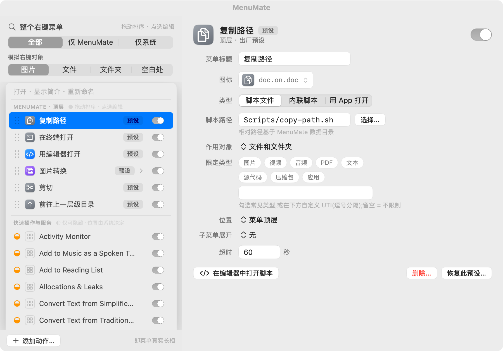
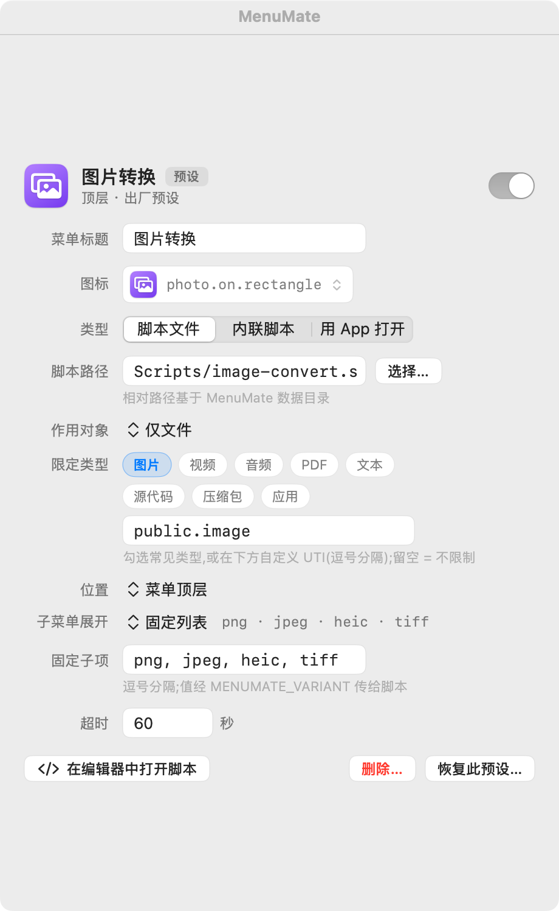

# MenuMate

**完全掌控 macOS Finder 的右键菜单。**

[English](README.md) · 简体中文

MenuMate 是一个**脚本优先**、开源(MIT)的菜单栏应用:加你自己的右键动作、管理别的工具碰不到的系统菜单项、安装社区「扩展包」——而且不会反复弹授权框。以 Developer ID 形式分发(非沙盒主 App + 沙盒 Finder Sync 扩展),最低 macOS 13 Ventura,界面支持 **English / 简体中文**。

<p align="center">
  
</p>

---

## 为什么用 MenuMate

市面上的右键工具(右键超人 / MouseBoost / 超级右键 / Service Station 等)都走 App Store 沙盒,**只能管理自己注入的菜单项**。MenuMate 走 Developer ID、跳出沙盒,因此能做到沙盒结构上做不到的事:

| 能力 | 沙盒竞品 | MenuMate |
|------|---------|---------|
| 注入自定义脚本动作 | 部分支持 | ✓ 脚本优先,全可配置 |
| 开关系统 Quick Actions / 服务 | ✗ | ✓ 读写 `pbs` 域 |
| 开关第三方 Finder 扩展 | ✗ | ✓ `pluginkit` |
| 安装社区扩展包(任意 git 仓库) | ✗ | ✓ 见 [扩展包规范](docs/pack-spec.md) |

**核心理念是脚本优先**:连内置能力都是可编辑的 zsh 脚本——预设 = 出厂脚本,随时改、删、恢复。

---

## 功能

### 脚本优先、极致可配置的自定义动作

每个动作都是 zsh 脚本(或内联片段,或「用 App 打开」)。可自定义图标(SF Symbol + 配色,或导入自己的图片),并按文件类型限定作用范围——勾选友好分类(图片/视频/音频/PDF/文本/源代码/压缩包/应用)或直接填 UTI。

<p align="center"></p>

### 管理「整个」右键菜单,不只是自己的项

一屏按真实样子预览右键菜单,带「模拟对象」开关(图片/文件/文件夹/空白处),所见即所得。按可控程度分区:**●** 自有与扩展包动作(排序、编辑、启停、删除),**◐** 系统快速操作/服务(隐藏),**○** 第三方扩展(开关)。

### 切换终端/编辑器,无需改脚本

在「通用」里选默认终端和编辑器;「在终端/编辑器打开」预设通过注入的环境变量遵从你的选择,不用动脚本。

### 社区扩展包

任意符合规范的 git 仓库都是扩展包。按 URL 导入,MenuMate **只读克隆**、强制你逐脚本审查,动作默认**禁用**直到你逐个启用。见[扩展包规范](docs/pack-spec.md)与[示例包](examples/example-pack/)。

### 双语 & 不反复弹窗

完整 **English / 简体中文** 界面(String Catalog,加语言只需加一列翻译)。因为扩展零文件访问、无 App Group 容器,MenuMate 规避了 macOS 14/15「想访问其他 App 数据」的反复弹窗;少量必需权限在引导里**一次性**请求。

---

## 内置预设(6 个可编辑脚本)

刻意精简——只留通用、填补 Finder 空缺、零外部假设、人人受益的动作。全部仅用 macOS 自带 CLI。在 **设置 › 右键菜单** 查看/编辑,**设置 › 通用** 恢复出厂。

| 脚本 | 动作 | 说明 |
|------|------|------|
| `copy-path.sh` | 复制路径 | `pbcopy`,多选每行一个路径 |
| `new-file.sh` | 新建文件 | 子菜单列举模板目录;`cp` + 自动重名编号 |
| `cut.sh` / `paste.sh` | 剪切 / 粘贴到此处 | 经数据目录 cutbuffer 移动 |
| `open-parent.sh` / `open-enclosing.sh` | 前往上一层级目录 | 在当前 Finder 窗口内上一层;浏览器上传框里发 `⌘↑` |

专用能力作为**可选扩展包**(在 **扩展包 › 浏览社区包** 安装),也是生态的真实示例:

- **[Developer Pack](https://github.com/Hibrielle/menumate-dev-pack)** —— 在终端/编辑器打开(遵从你的默认终端/编辑器)。
- **[Image Pack](https://github.com/Hibrielle/menumate-image-pack)** —— 图片转换 ▸ png/jpeg/heic/tiff。
- **[Navigation Pack](https://github.com/Hibrielle/menumate-nav-pack)** —— 前往路径… / 跳到剪贴板路径(Finder 地址栏)。

---

## 安装 / 从源码构建

环境:macOS 13+、Xcode 15+(String Catalog 所需)、Homebrew(装 `xcodegen`)。

```bash
make bootstrap   # 安装 xcodegen + 拷贝本地签名配置
make gen         # project.yml → MenuMate.xcodeproj(已 gitignore)
make test        # 运行 Core 单元测试
make build       # 调试构建
make run         # 构建并启动
```

随后启用 Finder 扩展(引导会带你到系统设置,或 `pluginkit -e use -i com.menumate.app.FinderExtension`),并完成一次性授权。签名+公证的发布版见 [docs/RELEASING.md](docs/RELEASING.md)。

## 脚本环境契约

每个脚本(预设或扩展包)以 `/bin/zsh` 执行,注入:`$1..$n`(选中项绝对路径)、`MENUMATE_PATHS`(换行分隔全部路径)、`MENUMATE_VARIANT`(子菜单选值)、`MENUMATE_TEMPLATES`/`MENUMATE_DATA`、`MENUMATE_TERMINAL`/`MENUMATE_EDITOR`;退出码 0 成功(stdout 首行为摘要),非 0 失败(stderr 进「最近执行」+ 通知)。详见 [pack-spec](docs/pack-spec.md#script-environment-contract)。

## 架构

| Target | 形态 | 沙盒 | 职责 |
|--------|------|------|------|
| MenuMate | SwiftUI 菜单栏 App(`LSUIElement`) | 否 | 配置、动作执行、系统菜单管理、扩展包 |
| FinderExtension | `FIFinderSync` 扩展 | 是 | 画菜单、转发点击 |
| MenuMateCore | 本地 Swift Package | — | 模型、配置编解码、规则匹配(单测覆盖) |

扩展**不读任何文件**:菜单数据由主 App 经 `DistributedNotificationCenter` 分块推送,无 App Group 容器——这是消除反复授权弹窗的关键。

## 文档与贡献

- [扩展包规范](docs/pack-spec.md) · [示例包](examples/example-pack/)
- [贡献指南](CONTRIBUTING.md) · [发布流程](docs/RELEASING.md)
- Core 119 个单测在每次 push 由 CI 运行(`.github/workflows/ci.yml`)

## 已知限制

- FinderSync 死区:`/Applications`、iCloud / File Provider 目录不触发扩展(系统行为)。
- 注入项固定在右键菜单底部(系统限制)。
- Shortcuts 型快速操作仅支持隐藏(状态在 TCC 保护库)。
- 预设标题随安装语言落盘,之后切系统语言不会自动重翻(恢复出厂可重新落盘)。

## 许可

[MIT](LICENSE) © 2026 Hibrielle
