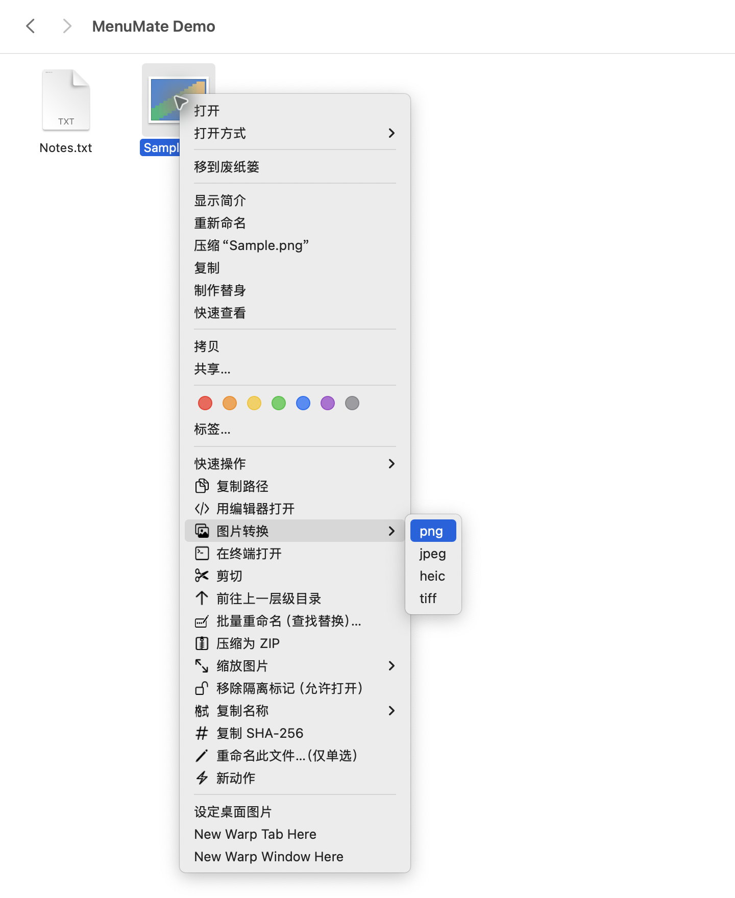
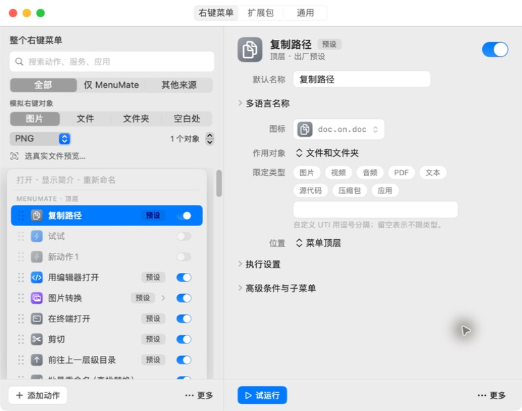
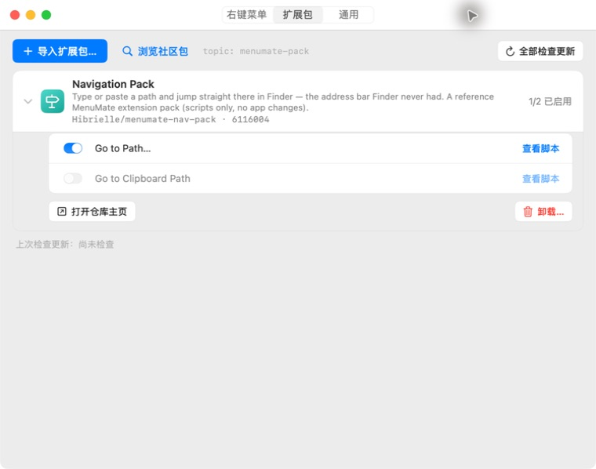

# MenuMate

**用可编辑脚本和按需弹出的 HTML 界面，定制 Finder 右键菜单。**

[English](README.md) · 简体中文

MenuMate 是开源的 macOS 菜单栏应用，用于创建文件动作、管理动作出现的条件，以及安装社区扩展包。主 App 负责执行，Finder Sync 扩展负责提供右键菜单。支持 macOS 13+，界面提供中文和英文，采用 MIT 许可。

本文描述当前源码的能力，已发布安装包不一定包含这里的全部功能。

## 产品截图

以下图片直接截取自运行中的 macOS App，动作名称来自本地配置。

**Finder 中的实际效果**：启用的动作出现在文件右键菜单中，“图片转换”可展开选择输出格式。



**右键菜单与动作编辑**：左侧预览匹配的动作，右侧修改动作设置。



**扩展包管理**：展开包，分别启用动作并查看脚本。



## 能做什么

- **直观整理动作。** 按图片、文件、文件夹、空白处预览；选择具体样本类型和数量，或读取真实文件的元数据。支持搜索动作、服务和应用，修改标题、图标、匹配条件及菜单位置。
- **按需使用弹窗。** 简单动作直接运行 zsh 文件、内联脚本或用 App 打开；需要用户选择参数的动作，可以先打开本地 HTML 界面，再把参数交给脚本。
- **用临时样本试运行。** 自动生成图片、文档、文件夹等资源，输入与输出均可通过“打开目录”查看。
- **安装扩展包。** 一个 Git 仓库对应一个包，包内可以有多个独立启用的动作，每个动作可以使用自己的脚本和 HTML 页面。
- **查看最近执行。** 按动作名、处理路径或输出搜索，筛选成功与失败，展开查看完整日期、耗时、退出码和输出。

App 界面跟随 macOS 语言。动作编辑器可填写“默认名称”，再展开“多语言名称”填写英文和简体中文；缺少翻译时回退默认名称。扩展包清单也支持包名、说明和动作名翻译，HTML 页面的翻译由作者提供。

## 菜单管理的实际范围

| 对象 | 当前支持 |
| --- | --- |
| MenuMate 自有动作和扩展包动作 | 开关、匹配、位置和排序；扩展包执行代码通过更新管理 |
| 传统应用服务 | 管理 `pbs` 暴露的受支持条目；修改也可能影响应用菜单中的“服务” |
| 第三方 Finder Sync 扩展 | 通过 `pluginkit` 整体开关受支持扩展 |
| 旋转、标记、移除背景等系统内置快速操作 | “应用服务”列表不能全面管理它们 |
| 菜单预览 | MenuMate 动作与真实执行共用匹配器；其他来源条目的出现条件由 Finder 决定 |

Finder Sync 的可用性会受目录位置、系统版本和文件提供程序影响。MenuMate 不能控制每个右键菜单中的所有条目。

## 从源码构建并试用

需要 macOS 13+、Xcode 16+，以及用于安装 `xcodegen` 的 Homebrew。开发构建使用 `Local.xcconfig` 中的签名配置；正式签名和公证是单独的发布步骤。

```sh
make bootstrap   # 安装 xcodegen，缺少配置时创建 Local.xcconfig
make test        # Core 测试
make test-packs  # 使用隔离目录测试真实 PackManager
make test-history # 隔离验证执行历史和错误处理
make test-storage # 验证配置写入失败及扩展包中断恢复
make build       # 构建 App 和 Finder 扩展
make run         # 构建并启动
```

产物位于 `build/Build/Products/Debug/MenuMate.app`。点击菜单栏的 MenuMate 图标进入设置，按引导启用 Finder 扩展。App 已运行但没有可见窗口时，再次打开 App 也会显示设置。实际需要的权限取决于使用的动作。

在“右键菜单”里点选动作进行编辑。“执行设置”和“高级条件与子菜单”可以展开，底部操作栏在滚动时保持可见。“通用”提供终端、编辑器选择，以及脚本和模板目录入口。

## 开发自己的扩展包

从[扩展包开发指南](docs/extension-development.zh.md)开始：创建普通脚本动作、添加 HTML 表单、接收选中文件、提交参数与显示结果，以及本地调试、更新和发布。

[可直接复制的入门包](examples/selection-info-pack/)包含一个普通动作和一个 HTML 动作；完整字段查询见[扩展包规范](docs/pack-spec.zh.md)。

## 试用 HTML 示例包

```sh
zsh scripts/prepare-image-tools-pack.sh
```

将命令输出的本地 Git 仓库路径粘贴到 **扩展包 → 导入**，查看源码后确认。这个“图片工具”包包含 JPEG 压缩和图片格式转换，两者各有自己的 HTML 弹窗。导入后默认关闭，可以分别试运行或启用。示例保留原图，遇到输出重名会自动编号。

也支持用 `owner/repo`、Git URL 或本地 Git 仓库路径导入符合规范的包；不能把仓库中的任意子目录单独作为包安装。“浏览社区包”发现带有 `menumate-pack` 标签的仓库。

更新审查覆盖整个包，包括 JS/CSS 依赖、清单、二进制摘要和符号链接。更新保留用户相对旧默认值修改的标题和位置，以及排序与启用状态。重复导入已安装的包会提示使用“检查更新”。更新和卸载均以整个包为单位。

导入、更新和卸载使用恢复记录，同时保护包目录、安装记录和动作配置。操作失败会恢复原状态；App 意外退出后，下次启动会回滚未提交的操作，或完成已提交操作的清理。包内动作排队、执行中或 HTML 弹窗未关闭时，不能更新或卸载该包。恢复失败时会保留备份，暂停动作执行，直到恢复成功。

设置更改保存成功后才会同步给 Finder。保存失败时，继续使用上次保存的配置并显示错误，动作编辑器提供“重试保存”。损坏的配置和安装记录会被保留，不会被静默覆盖。

参见[中文版扩展包规范](docs/pack-spec.zh.md)、[普通脚本示例](examples/example-pack/)和[HTML 示例包](examples/image-tools-pack/)。

## 最近执行

从菜单栏打开“最近执行”。普通动作完成后，最多保留 50 条记录，存储在本地 `execution-log.json`。新记录包含执行耗时（不含排队等待）、退出码、最多 20 个处理路径、子菜单选项，以及 stdout、stderr 各前 16,000 个字符。旧记录继续显示原来保存的信息，不会凭空补出耗时等字段。试运行结果显示在试运行窗口中。

点开记录查看详情，排查问题时可以“复制详情”。“清空”会先确认，清空范围包含当前筛选隐藏的全部记录，但不会删除处理过的文件或动作。历史加载、保存失败时，界面会显示错误。

## 脚本参数与试运行边界

脚本使用 `/bin/zsh` 执行，选中路径作为位置参数传入。推荐使用 `"$@"`，避免空格和换行文件名被拆开。`MENUMATE_VARIANT` 提供子菜单值，`MENUMATE_INPUT` 提供 HTML 弹窗提交的 JSON 对象，`MENUMATE_LOCALE` 提供 App 语言；还会传入数据目录、模板目录及终端/编辑器偏好，详见[脚本环境契约](docs/pack-spec.zh.md#脚本环境契约)。

临时样本位于 `~/Library/Application Support/MenuMate/TestRuns/<UUID>/`，每次创建独立的 Inputs、Data、Templates、Temporary 目录。目前只有标准 Templates 目录子菜单具备生成样本的约定，自定义目录不支持时会明确报错。

**临时样本不是进程沙箱。** 脚本仍以你的用户权限执行，硬编码路径、剪贴板操作和应用自动化仍可能影响真实环境。启用扩展包前应审查脚本和页面。HTML 页面及资源必须本地提供，不支持远程网页 URL；交互包必须显式声明 schema 2。

## 架构与贡献

| 组件 | 职责 |
| --- | --- |
| 主 App：SwiftUI / AppKit，非沙盒 | 设置、执行、HTML 窗口、历史及扩展包管理 |
| Finder Sync 扩展：沙盒 | 接收配置快照、读取选中项元数据、生成菜单并转发点击 |
| MenuMateCore：Swift Package | 模型、匹配、编解码、样本生成、包审查和历史存储 |

配置快照通过分块的 `DistributedNotificationCenter` 消息传递，不依赖 App Group 配置文件。Finder 扩展本身不执行动作脚本。

[贡献指南](CONTRIBUTING.zh.md) · [英文贡献指南](CONTRIBUTING.md) · [发布流程（英文）](docs/RELEASING.md)

CI 执行 Core、预设脚本、隔离包管理和执行历史测试，并编译 App 和扩展。UI 变化还需要原生界面验收，构建通过不能代替端到端验证。

## 当前限制

生成样本不能覆盖全部媒体格式和第三方脚本约定。没有提供翻译的动作名称不会因切换语言自动翻译。用于正式工作前，应结合源码和测试确认相关边界。

## 许可

[MIT](LICENSE) © 2026 Hibrielle
